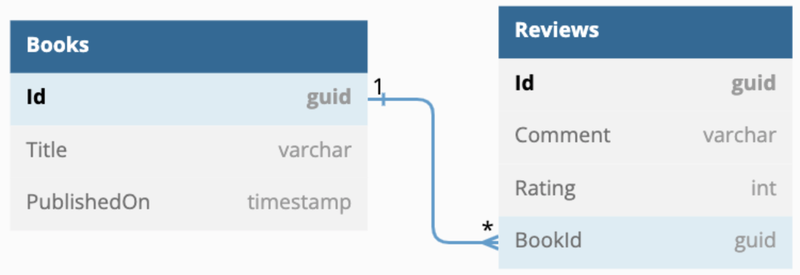

# A brief example of working with DotNet Core and Dapper
This is a DotNet Core web api repo that uses Dapper to fetch data from a Postgres database.

[Dapper](https://www.learndapper.com) is a simple object mapper for the Microsoft .NET platform. It is a framework for mapping an object-oriented domain model to a traditional relational database.

The data model is represented in the next image:
<p align="center">
  
</p>

### Technologies in this repo:
* DotNet Core 6
* Dapper
* Postgres (Docker Container)
* xUnit (Integration Tests)

#### Setup Database
Create the database container (you need to have Docker installed on your system):

```sh
docker run -d --name my-postgres -p 5432:5432 -e POSTGRES_PASSWORD=My@Passw0rd postgres
```

Stop and remove the container when needed:

```sh
docker stop my-postgres && docker rm my-postgres
```

#### Create Database

Migrate the database just calling the ConfigureDbMigration extension method:

```csharp
builder.Services.ConfigureDbMigration(builder.Configuration);
```

```csharp
app.MigrateDatabase().Run();
```

## Dapper extension methods
Dapper extends the IDbConnection interface with some of these methods:

#### **Scalar Values**

```csharp
using (var connection = new SQLiteConnection(connString))
{
    var sql = "select count(*) from products";
    var count = connection.ExecuteScalar(sql);
    Console.WriteLine($"Total products: {count}");
}
```

#### **Single Rows**

```csharp
using (var connection = new SQLiteConnection(connString))
{
    var sql = "select * from products where productid = 1";
    var product = connection.QuerySingle(sql);
    Console.WriteLine($"{product.ProductID} {product.ProductName}");
    Console.ReadLine();
}
```

#### **Multiple Rows**

```csharp
using (var connection = new SQLiteConnection(connString))
{
    var sql = "select * from customers";
    var customers = connection.Query(sql);
    foreach(var customer in customers)
    {
        Console.WriteLine($"{customer.CustomerID} {customer.CompanyName}");
    }
    Console.ReadLine();
}
```

#### **Non Query Commands**

Insert
```csharp
var sql = "insert into categories (CategoryName) values ('New Category')";
using (var connection = new SQLiteConnection(connString))
{
    var affectedRows =  connection.Execute(sql);
    Console.WriteLine($"Affected Rows: {affectedRows}");
}
```

Update
```csharp
var sql = @"update products set unitprice = unitprice * .1 where categoryid = 2";
using (var connection = new SQLiteConnection(connString))
{
    var affectedRows = connection.Execute(sql);
    Console.WriteLine($"Affected Rows: {affectedRows}");
}
```

Delete
```csharp
var sql = "delete from categories where CategoryName = 'New Category'";
using (var connection = new SQLiteConnection(connString))
{
    var affectedRows =  connection.Execute(sql);
    Console.WriteLine($"Affected Rows: {affectedRows}");
}
```